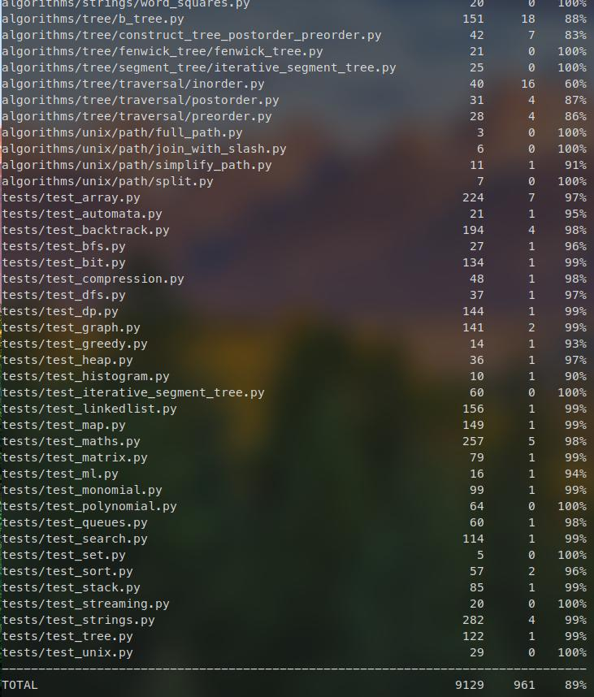
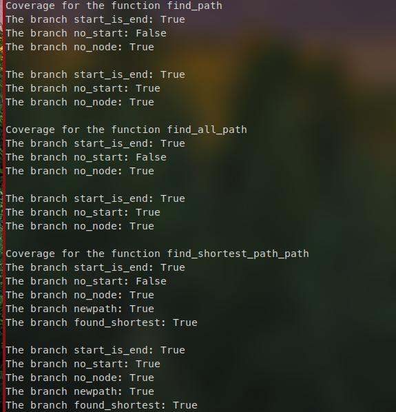
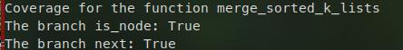

# Report for Assignment 1

## Project chosen

Name: algorithms

URL: https://github.com/keon/algorithms

Number of lines of code: 18023

Tool used to analyze: lizard

Programming language: Python

## Coverage measurement

### Existing tool

The tool we used was coverage, and to be more specific we used it as the pytest --cov flag. This library executed all test files that started with "test_". The method we followed to get the coverage was the following:
1. We forked the repository
2. We created a virtual environment and installed the required libraries
3. We changed any test files names that did not start with "test_" so they started with the correct prefix
4. We ran the command 

    ```
        pytest --cov --cov-report=html
    ```

This method produced both a report in the command line and a html that we used to find the functions that were not covered. 

The coverage percentage that we obtained after running this command was of 90% as shown in the following pictures

This is the coverage shown in the cli



This is the coverage shown in the html


### Your own coverage tool

Gonzalo Vela

The files I chose where the following
"algorithms/graph/find_path.py"

we chose to create diferent files where we wrote the code for the coverage. So the code in the find_path_coverage.py is the following:

```
m find_path import *

find_path_coverage = {
        "start_is_end": False,
        "no_start": False,
        "no_node": False,
}

find_all_path_coverage = {
        "start_is_end": False,
        "no_start": False,
        "no_node": False,
}

find_shortest_path_coverage = {
        "start_is_end": False,
        "no_start": False,
        "no_node": False,
        "newpath": False,
        "found_shortest": False
}

def print_coverage(coverage_keys):
    for key, value in coverage_keys.items():
        print(f"The branch {key}: {value}")

def main():
    # Define the variables of the graph
    graph = {
        'A': ['B', 'C'],
        'B': ['D'],
        'C': ['E', 'F'],
        'D': [],
        'E': ['B', 'D'],
        'F': []
    }

    print("Coverage for the function find_path")
    # Normal case
    find_path(graph, 'A', 'D', find_path_coverage, [])
    print_coverage(find_path_coverage)
   
    print()

    # No start case
    find_path(graph, '', 'D', find_path_coverage, [])
    print_coverage(find_path_coverage)

    print()

    print("Coverage for the function find_all_path")
    # Normal case
    find_all_path(graph, 'A', 'D', find_all_path_coverage, [])
    print_coverage(find_all_path_coverage)
    
    print()

    # Normal case
    find_all_path(graph, '', 'D', find_all_path_coverage, [])
    print_coverage(find_all_path_coverage)
    
    print()

    print("Coverage for the function find_shortest_path_path")
    # Normal case
    find_shortest_path(graph, 'A', 'D', find_shortest_path_coverage, [])
    print_coverage(find_shortest_path_coverage)
    
    print()

    # Normal case
    find_all_path(graph, '', 'D', find_shortest_path_coverage, [])
    print_coverage(find_shortest_path_coverage)

if __name__ == "__main__":
    main()
```

The file before implementing our coverage tool was:

```
"""
Functions for finding paths in graphs.
"""

# pylint: disable=dangerous-default-value
def find_path(graph, start, end, path=[]):
    """
    Find a path between two nodes using recursion and backtracking.
    """
    path = path + [start]
    if start == end:
        return path
    if not start in graph:
        return None
    for node in graph[start]:
        if node not in path:
            newpath = find_path(graph, node, end, path)
            return newpath
    return None

# pylint: disable=dangerous-default-value
def find_all_path(graph, start, end, path=[]):
    """
    Find all paths between two nodes using recursion and backtracking
    """
    path = path + [start]
    if start == end:
        return [path]
    if not start in graph:
        return []
    paths = []
    for node in graph[start]:
        if node not in path:
            newpaths = find_all_path(graph, node, end, path)
            for newpath in newpaths:
                paths.append(newpath)
    return paths

def find_shortest_path(graph, start, end, path=[]):
    """
    find the shortest path between two nodes
    """
    path = path + [start]
    if start == end:
        return path
    if start not in graph:
        return None
    shortest = None
    for node in graph[start]:
        if node not in path:
            newpath = find_shortest_path(graph, node, end, path)
            if newpath:
                if not shortest or len(newpath) < len(shortest):
                    shortest = newpath
    return shortest
```
And this is the code after our implementation

```
"""
Functions for finding paths in graphs.
"""

# pylint: disable=dangerous-default-value
def find_path(graph, start, end, coverage_keys, path=[]):
    """
    Find a path between two nodes using recursion and backtracking.
    """
    path = path + [start]
    if start == end:
        coverage_keys["start_is_end"] = True
        return path
    if not start in graph:
        coverage_keys["no_start"] = True
        return None
    for node in graph[start]:
        if node not in path:
            coverage_keys["no_node"] = True
            newpath = find_path(graph, node, end, coverage_keys, path)
            return newpath
    return None

# pylint: disable=dangerous-default-value
def find_all_path(graph, start, end, coverage_keys, path=[]):
    """
    Find all paths between two nodes using recursion and backtracking
    """
    path = path + [start]
    if start == end:
        coverage_keys["start_is_end"] = True
        return [path]
    if not start in graph:
        coverage_keys["no_start"] = True
        return []
    paths = []
    for node in graph[start]:
        if node not in path:
            coverage_keys["no_node"] = True
            newpaths = find_all_path(graph, node, end, coverage_keys, path)
            for newpath in newpaths:
                paths.append(newpath)
    return paths

def find_shortest_path(graph, start, end, coverage_keys, path=[]):
    """
    find the shortest path between two nodes
    """
    path = path + [start]
    if start == end:
        coverage_keys["start_is_end"] = True
        return path
    if start not in graph:
        coverage_keys["no_start"] = True
        return None
    shortest = None
    for node in graph[start]:
        if node not in path:
            coverage_keys["no_node"] = True
            newpath = find_shortest_path(graph, node, end, coverage_keys, path)
            if newpath:
                coverage_keys["newpath"] = True
                if not shortest or len(newpath) < len(shortest):
                    coverage_keys["found_shortest"] = True
                    shortest = newpath
    return shortest
```

We passed each of the ids dictionaries to the functions so they could edit them in-place

This is the coverage result



The second file I chose was 

"algorithms/heap/merge_sorted_k_lists.py"

This is the code I used to test the coverage

```
from merge_sorted_k_lists import merge_k_lists
"""
This file is different to the find_path as this one uses linked lists
"""
class ListNode(object):
    """ ListNode Class"""

    def __init__(self, val, next=None):
        self.val = val
        self.next = next

merge_list_coverage = {
    "is_node" : False, 
    "next": False
} 


def print_coverage(coverage_keys):
    for key, value in coverage_keys.items():
        print(f"The branch {key}: {value}")

def list_to_linked(lst):
    """
    Function to create a linked list from an array
    """
    if not lst:
        return None
    head = ListNode(lst[0])
    current = head
    for v in lst[1:]:
        current.next = ListNode(v)
        current = current.next
    return head 

def main():
    lists = [
        list_to_linked([1, 2, 3]),
        list_to_linked([4, 5, 6])
    ]
    
    print("Coverage for the function merge_sorted_k_lists")
    merge_k_lists(lists, merge_list_coverage);
    print_coverage(merge_list_coverage)

if __name__ == "__main__":
    main()
```

The code of the file before we implemented the coverage tool was

```
""" 

Merge k sorted linked lists and return it as one sorted list. Analyze and describe its complexity. 

""" 

from heapq import heappop, heapreplace, heapify 

from queue import PriorityQueue 

 

 

# Definition for singly-linked list. 

class ListNode(object): 

    """ ListNode Class""" 

 

    def __init__(self, val): 

        self.val = val 

        self.next = None 

 

def merge_k_lists(lists): 

    """ Merge List """ 

    dummy = ListNode(None) 

    curr = dummy 

    q = PriorityQueue() 

    for node in lists: 

        if node: 

            q.put((node.val, node)) 

    while not q.empty(): 

        curr.next = q.get()[1]  # These two lines seem to 

        curr = curr.next  # be equivalent to :-   curr = q.get()[1] 

        if curr.next: 

            q.put((curr.next.val, curr.next)) 

    return dummy.next 

 

 

""" 

I think my code's complexity is also O(nlogk) and not using heap or priority queue, 

n means the total elements and k means the size of list. 

 

The mergeTwoLists function in my code comes from the problem Merge Two Sorted Lists 

whose complexity obviously is O(n), n is the sum of length of l1 and l2. 

 

To put it simpler, assume the k is 2^x, So the progress of combination is like a full binary tree, 

from bottom to top. So on every level of tree, the combination complexity is n, 

because every level have all n numbers without repetition. 

The level of tree is x, ie log k. So the complexity is O(n log k). 

 

for example, 8 ListNode, and the length of every ListNode is x1, x2, 

x3, x4, x5, x6, x7, x8, total is n. 

 

on level 3: x1+x2, x3+x4, x5+x6, x7+x8 sum: n 

 

on level 2: x1+x2+x3+x4, x5+x6+x7+x8 sum: n 

 

on level 1: x1+x2+x3+x4+x5+x6+x7+x8 sum: n 

"""
```

**Note:** The original GitHub repository contained another function with the same name. We decided to remove one to avoid naming collisions, as both functions were essentially the same. 

and this is the code after the implementation

```

Merge k sorted linked lists and return it as one sorted list. Analyze and describe its complexity.
"""


from queue import PriorityQueue


# Definition for singly-linked list.
class ListNode(object):
    """ ListNode Class"""

    def __init__(self, val):
        self.val = val
        self.next = None

def merge_k_lists(lists, coverage_keys):
    """ Merge List """
    dummy = ListNode(None)
    curr = dummy
    q = PriorityQueue()
    for node in lists:
        if node:
            coverage_keys["is_node"] = True
            q.put((node.val, node))
    while not q.empty():
        curr.next = q.get()[1]  # These two lines seem to
        curr = curr.next  # be equivalent to :-   curr = q.get()[1]
        if curr.next:
            coverage_keys["next"] = True
            q.put((curr.next.val, curr.next))
    return dummy.next


"""
I think my code's complexity is also O(nlogk) and not using heap or priority queue,
n means the total elements and k means the size of list.

The mergeTwoLists function in my code comes from the problem Merge Two Sorted Lists
whose complexity obviously is O(n), n is the sum of length of l1 and l2.

To put it simpler, assume the k is 2^x, So the progress of combination is like a full binary tree,
from bottom to top. So on every level of tree, the combination complexity is n,
because every level have all n numbers without repetition.
The level of tree is x, ie log k. So the complexity is O(n log k).

for example, 8 ListNode, and the length of every ListNode is x1, x2,
x3, x4, x5, x6, x7, x8, total is n.

on level 3: x1+x2, x3+x4, x5+x6, x7+x8 sum: n

on level 2: x1+x2+x3+x4, x5+x6+x7+x8 sum: n

on level 1: x1+x2+x3+x4+x5+x6+x7+x8 sum: n
"""
```

This is the coverage result




## Coverage improvement

### Individual tests

<The following is supposed to be repeated for each group member>

<Group member name>

<Test 1>

<Show a patch (diff) or a link to a commit made in your forked repository that shows the new/enhanced test>

<Provide a screenshot of the old coverage results (the same as you already showed above)>

<Provide a screenshot of the new coverage results>

<State the coverage improvement with a number and elaborate on why the coverage is improved>

<Test 2>

<Provide the same kind of information provided for Test 1>

### Overall

<Provide a screenshot of the old coverage results by running an existing tool (the same as you already showed above)>

<Provide a screenshot of the new coverage results by running the existing tool using all test modifications made by the group>

## Statement of individual contributions

<Write what each group member did>

